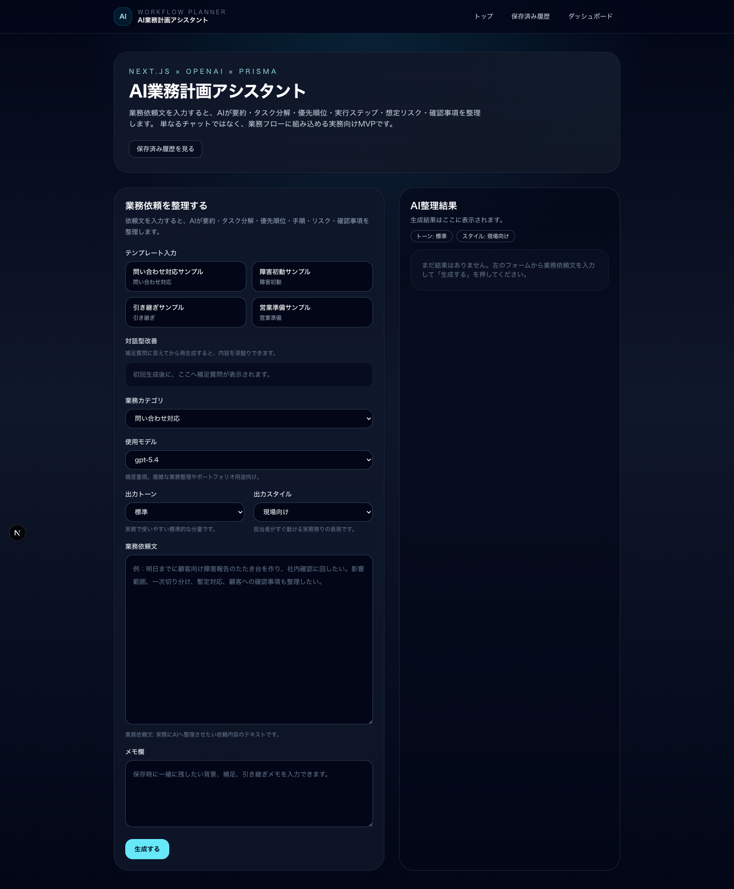
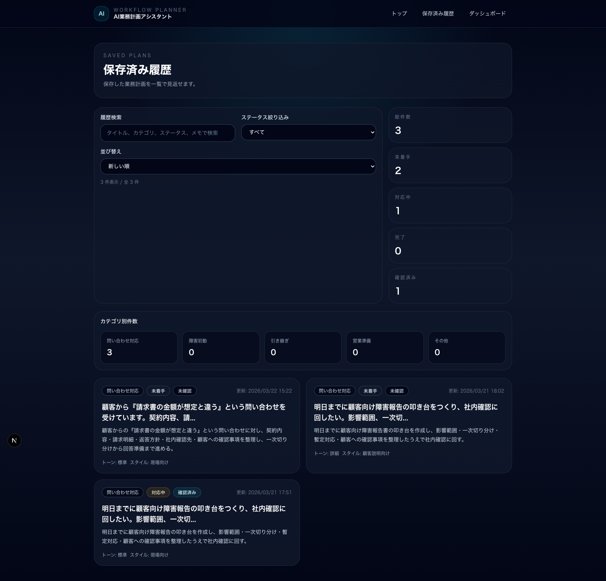
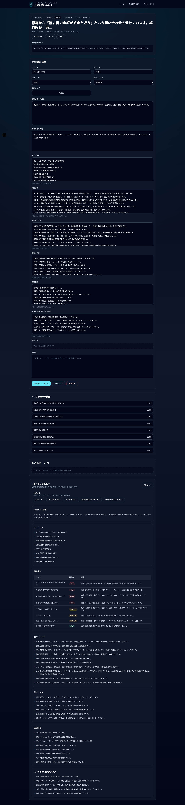
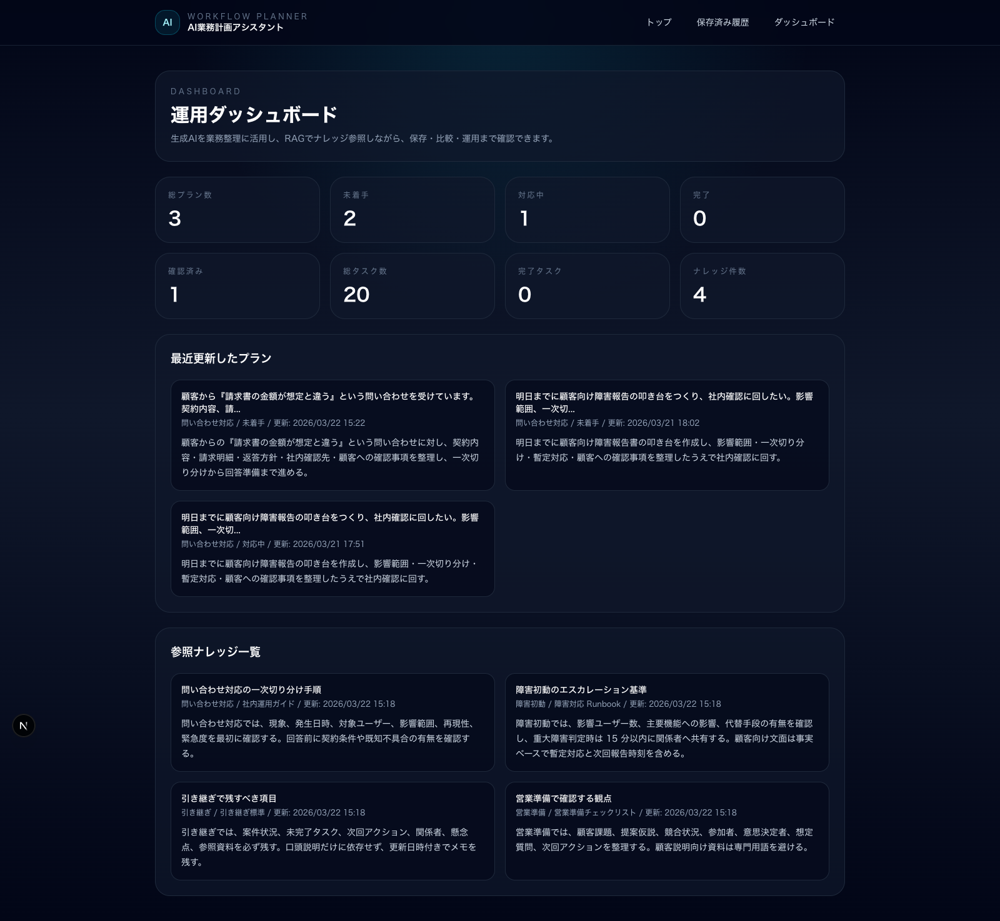

# AI業務計画アシスタント

> ユーザーの依頼から、タスク分解・優先度・リスクを構造化して生成するAI業務計画アプリ

---

## 概要

ユーザーの入力内容をもとに、AIがタスク分解・優先度設定・リスク分析・チェック項目を生成し、  
**実行可能な業務計画として構造化するアプリ**です。

単なる文章生成ではなく、**業務で再利用可能な構造データとして扱うことを重視して設計**しています。  
さらに、生成して終わりではなく、保存・履歴管理・編集・比較・ダッシュボード確認まで含めて運用できる構成にしています。

---

## 想定課題

- タスクが曖昧で、何から手をつけるべきか分からない
- 計画作成が属人化している
- リスクや優先度の考慮が抜け漏れする
- 計画作成に時間がかかる

---

## 解決アプローチ

- AIによるタスクの分解・構造化
- 優先度・リスク・チェック項目の自動生成
- フォローアップ質問による精度向上
- ローカルナレッジ参照による文脈強化
- 保存・編集・比較を前提とした運用設計

---

## 主な機能

- タスク分解（`tasks` / `steps`）
- 優先度設定（`priorities`）
- リスク分析（`risks`）
- チェックリスト生成（`checks`）
- フォローアップ質問生成（`followUpQuestions`）
- RAGによる関連ナレッジ参照
- 計画保存・履歴管理
- 保存済み計画の再編集
- 再生成結果との比較表示
- ステータス管理、確認フラグ、メモ
- 検索・絞り込み・並び替え
- ダッシュボード表示
- Markdown / Text / JSON エクスポート

---

## 技術スタック

- Next.js
- TypeScript
- Prisma
- SQLite
- OpenAI API
- Tailwind CSS

---

## アーキテクチャ

UI  
→ API Route  
→ OpenAI API  
→ Prisma / SQLite に保存  
→ UIへ構造化データとして表示

---

## 出力例（構造化データ）

{
  "tasks": [],
  "priorities": [],
  "risks": [],
  "checks": []
}

---
## 処理フロー
入力 → AI構造化 → フォローアップ → RAG補完 → 保存 → 可視化

---
## このアプリの特徴

- 文章ではなく**構造化データ**として計画を生成
- タスク・優先度・リスク・確認事項を分離して扱う設計
- フォローアップ質問で入力不足を補完
- ローカルナレッジ参照で実務文脈を強化
- 保存、再編集、比較、運用まで含めた構成

---

## AI設計のポイント

- 出力をJSON構造で扱い、再利用性を確保
- `tasks / priorities / risks / checks / steps` を明確に分離
- フォローアップ質問により入力情報を補完
- 関連ナレッジをプロンプトへ統合して一貫性を向上

---

## 技術的な工夫

### 構造化出力の設計

AIの出力を単なる文章ではなく、  
`requestSummary / tasks / priorities / steps / risks / checks / followUpQuestions`  
の構造で管理しています。

これにより、UI上での再利用、編集、比較、エクスポートがしやすい構成にしています。

---

### フォローアップ質問による精度向上

初回入力だけでは情報が不足するケースがあるため、  
AIが追加質問を生成し、ユーザーが補足回答を返したうえで再生成できる設計にしています。

---

### RAGによる文脈強化

SQLite に保存したローカルナレッジから関連情報を検索し、  
プロンプトへ組み込むことで、より実務に寄った計画生成を目指しています。

---

### データ永続化

Prisma + SQLite を用いて計画を保存し、  
履歴の参照、再編集、再生成比較、ダッシュボード分析が可能な構成にしています。

---

## 設計上の判断とトレードオフ

### なぜ構造化出力を採用したか

文章生成だけでは再利用や運用がしづらいため、  
業務で扱いやすいデータとして保存・編集できる構造化形式を採用しました。

---

### なぜRAGを導入したか

単発の生成だけでは文脈が弱くなりやすいため、  
ローカルナレッジを参照して計画の一貫性と実務適合性を高めています。

---

### なぜフォローアップを入れたか

初期入力だけでは不十分なケースが多いため、  
追加質問で情報を補完し、生成精度を上げる設計にしています。

---

## 効果

- タスクの具体化により着手までの時間を短縮
- リスクの可視化により抜け漏れを防止
- 計画作成の属人化を軽減
- 保存・比較により再利用しやすい運用基盤を実現

---

## スクリーンショット

### トップページ



### 履歴一覧



### 詳細ページ



### ダッシュボード



---

## 学びと今後の改善

### 学び

- AIは構造化することで再利用価値が上がる
- 入力補完の設計が生成精度に大きく影響する
- 業務アプリでは生成後の保存・編集・運用まで重要

---

### 今後の改善

- 類似計画の検索機能
- 精度評価ロジックの導入
- チーム共有機能
- 権限管理

---

## セットアップ

```bash
npm install
```

`.env.local` を作成して以下を設定します。

```env
DATABASE_URL="file:./prisma/dev.db"
OPENAI_API_KEY="your_openai_api_key"
OPENAI_PLAN_MODEL="gpt-5.4"
```

```bash
npx prisma generate
npx prisma db push
npm run dev
```

---

## まとめ

本アプリは、AIを用いたタスク生成を単なる文章ではなく**構造データ**として扱い、  
業務で再利用可能な計画生成システムとして設計したポートフォリオです。
